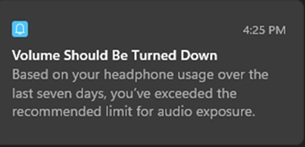

# Technology as a peer

### This kr*p. I hate

I have not even used headphones in weeks. Someone, somewhere decided it is a good thing to give technology authority, even if only a suggestion, it is unsolicited.  My property telling me what I should and should not do. 

That leads to making it autonomous, once they made it ok for our apps, operating systems, to start giving us unwelcome advice, then how much further until it made it ok to change our systems without our knowledge or consent.

Then, our systems and tools began shifting under our feet.  A process I may depend on today could be “disallowed” tomorrow. So, the break the integration to enforce. Used to be I didn’t even think when I sat down to work, that my software may not do what I need it to do. What it did only yesterday.  

I know the excuse. “How could we know if we did this, it could cause that?”  Because since we first started to build interconnected processes, we say the effects pone component could have on another. 

Or, did these brainiacs never toy with analog circuits, digital circuits, before moving into system architecture.  If they didn’t, I would argue that maybe they are not qualified for the positions they have been given.

Or maybe we are not as advanced as we think we are. Personally, considering the affects of somethig you put in teh field, even low percentage ones. is part of the proceess BEFORE deploying. 
